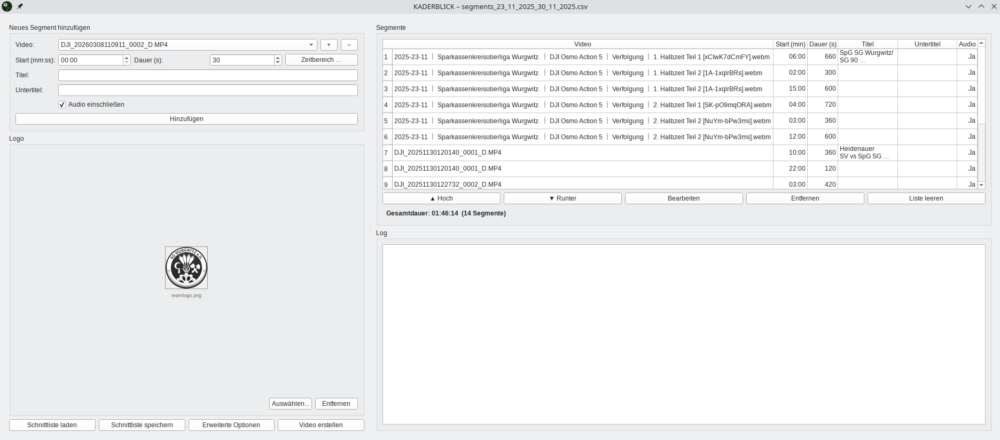

# KADERBLICK Video Combiner

Ein Werkzeug für Fußballvereine, das automatisch Spielszenen aus Videoaufnahmen zur Spielanalyse herausschneidet, mit Titeln versieht, zu einem Gesamtvideo zusammenfügt und optional direkt auf YouTube hochlädt – alles mit wenigen Klicks über eine grafische Oberfläche.

<p align="center">
  
</p>

---

## Inhaltsverzeichnis

1. [Was macht dieses Programm?](#was-macht-dieses-programm)
2. [Voraussetzungen](#voraussetzungen)
3. [Einrichtung (Erstinstallation)](#einrichtung-erstinstallation)
4. [Schnellstart (GUI)](#schnellstart-gui)
5. [Schritt für Schritt: Video erstellen](#schritt-für-schritt-video-erstellen)
6. [Die CSV-Datei (Schnittliste)](#die-csv-datei-schnittliste)
7. [Erweiterte Optionen](#erweiterte-optionen)
8. [YouTube-Upload einrichten](#youtube-upload-einrichten)
9. [Kommandozeilen-Modus (CLI)](#kommandozeilen-modus-cli)
10. [GPU-Beschleunigung (NVIDIA)](#gpu-beschleunigung-nvidia)
11. [Ordnerstruktur](#ordnerstruktur)
12. [Häufige Fragen (FAQ)](#häufige-fragen-faq)
13. [Fehlerbehebung](#fehlerbehebung)

---

## Was macht dieses Programm?

Du hast mehrere lange Videoaufnahmen von Fußballspielen und möchtest daraus ein kompaktes Analysevideo erstellen? Genau dafür ist der **KADERBLICK Video Combiner** da.

**Das Programm erledigt für dich:**

1. **Szenen herausschneiden** – Du sagst, ab welcher Minute und wie lange geschnitten werden soll
2. **Titeleinblendungen erstellen** – Jede Szene bekommt automatisch eine Titelkarte mit Vereinslogo, Titel und Untertitel
3. **Alles zusammenfügen** – Alle Szenen werden zu einem einzigen Video zusammengesetzt
4. **YouTube-Kapitel erzeugen** – Automatische Kapitelmarken, damit Zuschauer direkt zur gewünschten Szene springen können
5. **Auf YouTube hochladen** – Das fertige Video wird direkt hochgeladen, inklusive Titel, Playlist und Kapitel

**Beispiel:** Aus 5 Videoaufnahmen à 90 Minuten werden 12 ausgewählte Szenen zu einem 8-Minuten-Analysevideo mit professionellen Titeleinblendungen.

---

## Voraussetzungen

| Was wird benötigt? | Wozu? | Installation |
|---|---|---|
| **Python 3.10+** | Programmiersprache, in der das Tool geschrieben ist | [python.org](https://www.python.org/downloads/) |
| **FFmpeg** | Verarbeitet die Videos (Schneiden, Zusammenfügen, Komprimieren) | Siehe [GPU-Beschleunigung](#gpu-beschleunigung-nvidia) oder `sudo apt install ffmpeg` |
| **NVIDIA-Grafikkarte** *(optional)* | Beschleunigt die Videoverarbeitung um ein Vielfaches | Automatisch erkannt, wenn vorhanden |

> **Tipp für Anfänger:** Python und FFmpeg müssen nur einmal installiert werden. Danach startest du das Programm einfach per Doppelklick oder Befehl.

---

## Einrichtung (Erstinstallation)

Diese Schritte musst du nur **einmal** durchführen.

### 1. Projektordner öffnen

Öffne ein Terminal (Linux: `Strg+Alt+T` / Windows: `Win+R` → `cmd`) und navigiere zum Projektordner:

```bash
cd /pfad/zu/videoschnitt
```

### 2. Virtuelle Umgebung erstellen

Eine virtuelle Umgebung hält die benötigten Programmpakete getrennt von deinem restlichen System:

```bash
python3 -m venv .venv
```

### 3. Virtuelle Umgebung aktivieren

```bash
# Linux / macOS:
source .venv/bin/activate

# Windows:
.venv\Scripts\activate
```

> Nach der Aktivierung siehst du `(.venv)` am Anfang deiner Terminal-Zeile.

### 4. Programmpakete installieren

```bash
pip install -r requirements.txt
```

Damit werden alle benötigten Pakete automatisch heruntergeladen und installiert.

### 5. Fertig!

Du kannst das Programm jetzt starten (siehe nächster Abschnitt).

> **Wichtig:** Vor jedem Start musst du die virtuelle Umgebung aktivieren (Schritt 3), sofern sie nicht noch aktiv ist.

---

## Schnellstart (GUI)

```bash
python main.py
```

Das Programm öffnet eine grafische Oberfläche. Kein Terminal-Wissen nötig – alles wird per Mausklick bedient.

---

## Schritt für Schritt: Video erstellen

### 1. Quellvideos bereitstellen

Kopiere deine Videoaufnahmen (z. B. `DJI_20260228110752_0001_D.MP4`) in den Ordner **`input/`**.

> **Tipp:** Das Programm erkennt das Spieltag-Datum automatisch aus den DJI-Dateinamen und benennt das Ausgabevideo entsprechend (z. B. `Spielanalyse_28_02_2026.mp4`).

### 2. Vereinslogo bereitstellen *(optional)*

Lege dein Vereinslogo als Bilddatei (PNG empfohlen) in den Ordner `input/` – z. B. `input/teamlogo.png`. Das Logo erscheint dann auf jeder Titeleinblendung.

### 3. Szenen (Segmente) zusammenstellen

In der linken Spalte der Oberfläche gibst du für jede Szene an:

| Feld | Bedeutung | Beispiel |
|---|---|---|
| **Video** | Welches Quellvideo? (Dropdown-Liste) | `DJI_20260228110752_0001_D.MP4` |
| **Startzeit** | Ab welcher Stelle schneiden? (Minuten:Sekunden) | `05:30` → ab 5 Min 30 Sek |
| **Dauer** | Wie viele Sekunden lang? | `45` → 45 Sekunden |
| **Titel** | Überschrift der Szene *(optional)* | `1. Halbzeit` |
| **Untertitel** | Zweite Zeile *(optional)* | `Anstoß und Spielaufbau` |
| **Audio** | Ton beibehalten? (Häkchen) | ✅ |

Klicke nach jeder Eingabe auf **„Hinzufügen"**. Die Szene erscheint in der Tabelle rechts.

> **Zeitbereich-Hilfe:** Du kennst Start- und Endzeit, aber nicht die Dauer? Klicke auf **„Zeitbereich…"** – das Programm rechnet die Dauer automatisch aus.

### 4. Segmente in der Tabelle anpassen

In der rechten Tabelle kannst du:

- **Titel/Untertitel direkt bearbeiten** – einfach in die Zelle klicken
- **Reihenfolge ändern** – mit den Pfeiltasten ▲ / ▼
- **Szene bearbeiten** – über den Stift-Button ✏️ öffnet sich ein Bearbeitungsdialog
- **Szene entfernen** – über den Papierkorb-Button 🗑️

Unter der Tabelle siehst du die **Gesamtdauer** des Videos und die Anzahl der Segmente.

### 5. Erweiterte Optionen *(optional)*

Über **„Erweiterte Optionen"** erreichst du zusätzliche Einstellungen – siehe Abschnitt [Erweiterte Optionen](#erweiterte-optionen).

### 6. Video erstellen

Klicke auf **„Video erstellen"**. Im Protokollfenster unten rechts siehst du den Fortschritt:

1. **Videoanalyse** – Auflösung und Format aller Quellvideos werden erkannt
2. **Segment-Extraktion** – Alle Szenen werden parallel herausgeschnitten
3. **Zusammenfügen** – Titeleinblendungen und Szenen werden zum Gesamtvideo montiert
4. **YouTube-Upload** *(falls aktiviert)* – Das Video wird hochgeladen

Nach Abschluss erscheint eine Erfolgsmeldung mit dem Speicherort des fertigen Videos.

> **Intelligenter Cache:** Bereits verarbeitete Szenen werden wiederverwendet. Wenn du nur eine neue Szene hinzufügst, müssen die anderen nicht erneut geschnitten werden.

---

## Die CSV-Datei (Schnittliste)

Alle Szenen werden in der Datei `segments.csv` gespeichert. Du kannst sie über die GUI verwalten oder direkt mit einem Texteditor / Excel bearbeiten.

### Format

```csv
videoname,start_minute,length_seconds,title,sub_title,audio
DJI_20260228110752_0001_D.MP4,3.0,45,1. Halbzeit,Anstoß,1
DJI_20260228110752_0001_D.MP4,12.5,60,1. Halbzeit,Erste Torchance,1
DJI_20260228120000_0002_D.MP4,0.0,30,2. Halbzeit,Anstoß,1
```

### Spalten erklärt

| Spalte | Bedeutung | Pflichtfeld? | Beispiel |
|---|---|---|---|
| `videoname` | Dateiname des Quellvideos | ✅ Ja | `DJI_20260228110752_0001_D.MP4` |
| `start_minute` | Startzeit in Minuten (Dezimalzahl) | ✅ Ja | `3.0` = Minute 3:00, `12.5` = Minute 12:30 |
| `length_seconds` | Dauer der Szene in Sekunden | ✅ Ja | `45` |
| `title` | Titel für die Titeleinblendung | ❌ Optional | `1. Halbzeit` |
| `sub_title` | Untertitel für die Titeleinblendung | ❌ Optional | `Anstoß und Spielaufbau` |
| `audio` | Ton ein (1) oder aus (0) | ❌ Optional | `1` (Standard) |

> **Hinweis:** Wenn eine Szene über das Ende des Videos hinausragt, wird die Dauer automatisch gekürzt.

### CSV prüfen und korrigieren

Du möchtest vor der Verarbeitung prüfen, ob alle Angaben stimmen? Nutze den Validator:

```bash
# Nur prüfen (ändert nichts):
python validate_csv.py --csv segments.csv --input input/

# Automatisch korrigieren (erstellt vorher ein Backup):
python validate_csv.py --csv segments.csv --input input/ --fix
```

Mögliche Meldungen:

| Symbol | Bedeutung |
|---|---|
| ❌ | Videodatei nicht gefunden |
| ❌ | Startzeit liegt nach dem Ende des Videos |
| ⚠️ | Szene ist länger als das verbleibende Video → wird automatisch gekürzt |
| ✅ | Alles in Ordnung |

---

## Erweiterte Optionen

Über den Button **„Erweiterte Optionen"** in der GUI erreichst du zwei Reiter:

### Reiter „Video"

| Option | Beschreibung |
|---|---|
| **Keine Audio-Spur** | Entfernt den Ton aus allen Segmenten und dem Endvideo |
| **Verlustlose Ausgabe** | Erstellt das Video ohne YouTube-Komprimierung (größere Datei, volle Qualität) |
| **Kein Bitrate-Limit** | Deaktiviert die automatische Bitrate-Begrenzung. Standardmäßig wird die Bitrate dynamisch an die Auflösung und Framerate angepasst, orientiert an den tatsächlichen YouTube-Streaming-Bitraten (z. B. 4K 30fps → max. 20 Mbps, 1080p 30fps → max. 6 Mbps). Mit dieser Option wird kein Limit gesetzt – sinnvoll für lokale Archivierung, führt aber zu deutlich größeren Dateien. |
| **Rechner nach Fertigstellung herunterfahren** | Fährt den Computer automatisch herunter, sobald Verarbeitung und Upload fertig sind. Es erscheint vorher ein Hinweis mit Abbruchmöglichkeit. |

### Reiter „YouTube"

| Option | Beschreibung |
|---|---|
| **YouTube-Upload aktivieren** | Schaltet den automatischen Upload ein/aus |
| **Video-Titel** | Titel des YouTube-Videos (leer = wird automatisch aus den Spieldaten erzeugt) |
| **Playlist** | YouTube-Playlist, in die das Video eingeordnet wird. Du kannst eine **Playlist-ID** (z. B. `PLxxxxx…`) oder einen **Playlist-Namen** eingeben – existiert der Name noch nicht, wird die Playlist automatisch erstellt. |
| **Privatsphäre** | `unlisted` (nicht gelistet, nur mit Link erreichbar), `private` (nur du), `public` (öffentlich) |
| **Tags** | Suchbegriffe, mit Komma getrennt (z. B. `Fußball,Analyse,Training`) |

> Alle Einstellungen werden automatisch in `config/settings.json` gespeichert und beim nächsten Start wiederhergestellt.

---

## YouTube-Upload einrichten

Der YouTube-Upload erfordert eine **einmalige Einrichtung** bei Google. Eine ausführliche Schritt-für-Schritt-Anleitung findest du in:

📄 **[docs/YOUTUBE_SETUP.md](docs/YOUTUBE_SETUP.md)**

### Kurzfassung

1. Erstelle ein Projekt in der [Google Cloud Console](https://console.cloud.google.com/)
2. Aktiviere die **YouTube Data API v3**
3. Erstelle **OAuth 2.0 Zugangsdaten** (Typ: Desktop-Anwendung)
4. Lade die JSON-Datei herunter und speichere sie als `config/client_secrets.json`
5. Beim ersten Upload öffnet sich ein Browser-Fenster zur Anmeldung bei Google

### Standard-Einstellungen anpassen

Kopiere die Vorlage und passe sie an deine Bedürfnisse an:

```bash
cp config/youtube_config.py.dist config/youtube_config.py
```

Öffne `config/youtube_config.py` mit einem Texteditor und ändere die Werte:

```python
# Deine Standard-Playlist (Name oder ID, None = keine Playlist)
YOUTUBE_DEFAULT_PLAYLIST = "Spielanalysen 2026"

# Sichtbarkeit: "public" (öffentlich), "private" (nur du), "unlisted" (nur mit Link)
YOUTUBE_DEFAULT_PRIVACY = "unlisted"

# Upload automatisch nach Videoerzeugung starten?
YOUTUBE_UPLOAD_ENABLED = True

# Video-Kategorie (17 = Sport)
YOUTUBE_DEFAULT_CATEGORY = "17"

# Suchbegriffe (mit Komma getrennt)
YOUTUBE_DEFAULT_TAGS = "Fußball,Spielanalyse,Training"
```

> Diese Werte können jederzeit über die GUI oder CLI-Parameter überschrieben werden.

---

## Kommandozeilen-Modus (CLI)

Für fortgeschrittene Nutzer oder automatisierte Abläufe kann das Programm auch ohne grafische Oberfläche gestartet werden:

```bash
python main.py --cli
```

### Beispiele

```bash
# Standard: alle Szenen aus segments.csv verarbeiten und hochladen
python main.py --cli

# Ohne YouTube-Upload
python main.py --cli --no-upload

# Eigener Dateiname für das Ausgabevideo
python main.py --cli --output output/mein_video.mp4

# Maximale Parallelisierung (z. B. 12 gleichzeitige Prozesse)
python main.py --cli --workers 12

# Cache löschen (alle Zwischendateien werden neu erzeugt)
python main.py --cli --clean-cache

# Nur Upload (Video wurde schon erstellt)
python main.py --cli --upload-only

# Video ohne Ton
python main.py --cli --no-audio

# Rechner nach Fertigstellung herunterfahren
python main.py --cli --shutdown

# YouTube: öffentlich, in bestimmte Playlist, mit Tags
python main.py --cli \
  --youtube-playlist "Spielanalysen 2026" \
  --youtube-privacy public \
  --youtube-tags "Fußball,Training,Analyse"
```

### Alle Parameter

| Parameter | Kurz | Beschreibung | Standard |
|---|---|---|---|
| `--cli` | | Kommandozeilen-Modus (ohne GUI) | GUI |
| `--csv` | `-c` | Pfad zur Schnittliste | `segments.csv` |
| `--input` | `-i` | Ordner mit den Quellvideos | `input/` |
| `--output` | `-o` | Pfad für das Ausgabevideo | automatisch |
| `--workers` | `-w` | Anzahl paralleler Prozesse | CPU-Kerne − 2 |
| `--no-audio` | | Kein Ton | aus |
| `--no-youtube-opt` | | Keine YouTube-Komprimierung (volle Qualität) | aus |
| `--no-bitrate-limit` | | Kein Bitrate-Limit (YouTube-Begrenzung ignorieren) | aus |
| `--no-upload` | | YouTube-Upload deaktivieren | aus |
| `--upload-only` | | Nur Upload, kein Videoschnitt | aus |
| `--youtube-title` | | YouTube-Titel | aus Dateiname |
| `--youtube-playlist` | | Playlist-ID oder -Name | aus Konfiguration |
| `--youtube-privacy` | | `public`, `private` oder `unlisted` | `unlisted` |
| `--youtube-tags` | | Tags, mit Komma getrennt | aus Konfiguration |
| `--logo` | | Pfad zum Logo-Bild | `input/teamlogo.png` |
| `--clean-cache` | | Zwischendateien vorher löschen | aus |
| `--debug-cache` | | Debug-Infos zum Cache anzeigen | aus |
| `--shutdown` | | Rechner nach Fertigstellung herunterfahren | aus |

---

## GPU-Beschleunigung (NVIDIA)

Wenn dein Rechner eine **NVIDIA-Grafikkarte** besitzt (z. B. GeForce RTX 3060), kann das Programm die Videoverarbeitung erheblich beschleunigen:

| Modus | Geschwindigkeit (ca.) |
|---|---|
| Nur CPU (`libx264`) | 0,3× Echtzeit |
| GPU-Beschleunigung (`h264_nvenc` + CUDA) | 1,5× Echtzeit |

Die GPU-Beschleunigung wird **automatisch erkannt** – du musst nichts konfigurieren. Wenn keine NVIDIA-Karte verfügbar ist, wird automatisch die CPU verwendet.

### Voraussetzungen für GPU-Beschleunigung

- NVIDIA-Grafikkarte mit NVENC-Unterstützung (GTX 600+, RTX-Serie)
- Aktuelle NVIDIA-Treiber installiert
- FFmpeg mit CUDA/NVENC-Unterstützung kompiliert

> Im Projektordner liegt ein Script `build_ffmpeg.sh`, das FFmpeg mit voller GPU-Unterstützung kompiliert. Ausführung: `sudo bash build_ffmpeg.sh`

---

## Ordnerstruktur

```
videoschnitt/
│
├── main.py                    ← Startdatei (GUI + CLI)
├── segments.csv               ← Deine Schnittliste
├── validate_csv.py            ← Werkzeug zum Prüfen der Schnittliste
├── requirements.txt           ← Liste der benötigten Python-Pakete
│
├── input/                     ← Hier deine Quellvideos + Logo ablegen
│   ├── DJI_20260228110752_0001_D.MP4
│   ├── DJI_20260228120000_0002_D.MP4
│   └── teamlogo.png
│
├── output/                    ← Hier wird das Ergebnis gespeichert
│   ├── Spielanalyse_28_02_2026.mp4    ← Fertiges Video
│   ├── yt_chapters.txt                ← YouTube-Kapitelmarken
│   ├── segments/                      ← Zwischendateien (Szenen)
│   └── text_clips/                    ← Zwischendateien (Titelkarten)
│
├── config/                    ← Konfigurationsdateien
│   ├── settings.json              ← GUI-Einstellungen (automatisch)
│   ├── youtube_config.py          ← Deine YouTube-Standardwerte
│   ├── youtube_config.py.dist     ← Vorlage (nicht bearbeiten)
│   └── client_secrets.json        ← Google-Zugangsdaten für YouTube
│
├── src/                       ← Programmcode (nicht bearbeiten)
│   ├── main_utils.py              ← Pipeline-Steuerung
│   ├── processing.py              ← Videoverarbeitung & GPU-Erkennung
│   ├── ffmpeg_utils.py            ← FFmpeg-Hilfsfunktionen
│   ├── textclip.py                ← Titeleinblendungen
│   ├── youtube_upload.py          ← YouTube-Upload
│   ├── segment_utils.py           ← Dateinamen & Datumslogik
│   └── gui/                       ← Grafische Oberfläche
│
├── docs/
│   └── YOUTUBE_SETUP.md      ← YouTube-Einrichtungsanleitung
│
└── assets/
    └── kaderblick.png         ← Programmicon
```

---

## Häufige Fragen (FAQ)

### Muss ich mich mit Programmierung auskennen?

Nein. Das Programm startet standardmäßig mit einer grafischen Oberfläche. Du brauchst nur die [Einrichtung](#einrichtung-erstinstallation) einmal durchzuführen.

### Welche Videoformate werden unterstützt?

Alle Formate, die FFmpeg verarbeiten kann – insbesondere **MP4**, **MOV** und **MKV**. Auch HEVC/H.265, 4K und 10-Bit-Videos werden nativ unterstützt.

### Wie lange dauert die Verarbeitung?

Das hängt von der Anzahl und Länge der Szenen ab. Als Richtwert (reines erstellen des endgültigen Videos, ohne Extraktion, Verarbeitung und Upload):
- **Mit GPU** (NVIDIA): ca. 1,5× Echtzeit (10 Min. Video → ~7 Min.), komplett mit anschließendem Upload bei 100MBit/s ca 30 Min.
- **Ohne GPU**: ca. 0,3× Echtzeit (10 Min. Video → ~30 Min.), komplett mit anschließendem Upload bei 100MBit/s ca 90 Min.

Bereits verarbeitete Szenen werden zwischengespeichert und müssen beim nächsten Durchlauf nicht erneut geschnitten werden.

### Kann ich Videos von verschiedenen Spieltagen kombinieren?

Ja. Die Segmente können aus beliebig vielen verschiedenen Quellvideos und Spieltagen stammen. Der Dateiname wird automatisch aus allen vorkommenden Spieltag-Daten zusammengesetzt (z. B. `Spielanalyse_28_02_2026_07_03_2026.mp4`), kann aber für den upload nach YouTube unter "Erweiterte Optionen" auch manuell festgelegt werden.

### Was passiert bei unterschiedlichen Videoauflösungen?

Das Programm erkennt automatisch die Auflösung aller Quellvideos. Wenn alle identisch sind (z. B. 4K, gleicher Codec, gleiche Framerate), wird besonders schnell im **Stream-Copy-Modus** gearbeitet. Bei unterschiedlichen Formaten werden alle automatisch auf eine gemeinsame Auflösung gebracht.

### Was sind die YouTube-Kapitel?

YouTube-Kapitel ermöglichen es Zuschauern, direkt zu bestimmten Szenen im Video zu springen. Das Programm generiert automatisch eine Kapitelliste aus deinen Segment-Titeln und fügt sie als Videobeschreibung hinzu. Die Datei `output/yt_chapters.txt` enthält die Kapitelmarken.

### Kann ich den YouTube-Upload weglassen?

Ja. Entweder in den erweiterten Optionen der GUI den Haken bei „YouTube-Upload aktivieren" entfernen, oder in der Kommandozeile `--no-upload` verwenden.

### Was bedeutet „verlustlose Ausgabe"?

Standardmäßig wird das Video YouTube-optimiert komprimiert (H.264, gute Qualität bei kleinerer Dateigröße). Mit „Verlustlose Ausgabe" wird das Originalformat beibehalten – die Datei ist deutlich größer, aber ohne Qualitätsverlust.

### Was passiert, wenn ich das Fenster während der Verarbeitung schließe?

Das Programm fragt nach, ob du wirklich abbrechen möchtest. Alle laufenden FFmpeg-Prozesse werden sauber beendet. Bereits fertige Zwischendateien bleiben erhalten und können beim nächsten Start wiederverwendet werden.

---

## Fehlerbehebung

### „FFmpeg nicht gefunden"

FFmpeg muss installiert und im System-Pfad verfügbar sein. Prüfe mit:

```bash
ffmpeg -version
```

Falls nicht installiert:
- **Linux:** `sudo apt install ffmpeg`
- **Windows:** Lade FFmpeg von [ffmpeg.org](https://ffmpeg.org/download.html) herunter und füge den Ordner zum PATH hinzu
- **Mit GPU-Unterstützung:** Nutze das mitgelieferte Script `build_ffmpeg.sh`

### „PyQt5 nicht installiert"

```bash
pip install PyQt5
```

Oder installiere alle Abhängigkeiten neu:

```bash
pip install -r requirements.txt
```

### „GPU wird nicht erkannt"

Das Programm testet beim Start automatisch, ob NVENC verfügbar ist. Falls nicht:
1. Prüfe, ob ein NVIDIA-Treiber installiert ist: `nvidia-smi`
2. Prüfe, ob FFmpeg mit NVENC kompiliert wurde: `ffmpeg -encoders | grep nvenc`
3. Kompiliere FFmpeg ggf. mit GPU-Unterstützung neu: `sudo bash build_ffmpeg.sh`

Das Programm funktioniert auch ohne GPU – nur langsamer.

### „YouTube-Upload schlägt fehl"

1. Prüfe, ob `config/client_secrets.json` existiert
2. Lösche `youtube_token.pickle` und melde dich erneut an
3. Prüfe, ob die YouTube Data API v3 im Google-Projekt aktiviert ist
4. Siehe [docs/YOUTUBE_SETUP.md](docs/YOUTUBE_SETUP.md) für die vollständige Anleitung

### Zwischendateien aufräumen

Wenn etwas nicht stimmt, kannst du den Cache löschen. Alle Szenen und Titelkarten werden dann neu erstellt:

```bash
# In der GUI: „Erweiterte Optionen" → „Cache löschen"
# In der CLI:
python main.py --cli --clean-cache
```
- Alternative Eingabe über "Zeitbereich festlegen" (Start- und Endzeit)
- Verwaltung von Segmenten in einer übersichtlichen Tabelle
- **Erweiterte Optionen**: Zugriff auf alle Kommandozeilen-Parameter wie YouTube-Upload-Einstellungen, Audio-Deaktivierung, etc.
- Automatisches Speichern der Segmente in `segments.csv`
- Direkter Start der Video-Erstellung aus der GUI heraus

## Hinweise & Tipps

- Die Kapitelbeschreibung (`yt_chapters.txt`) wird automatisch als YouTube-Beschreibung eingefügt
- Die Video-Kategorie ist standardmäßig "Sports" (ID 17)
- Die wichtigsten Einstellungen können in `config/youtube_config.py` angepasst werden
- Die CLI-Optionen überschreiben die Defaults aus der Konfigurationsdatei

## Vorbereitung für ImageMagick (nur falls Fehler bei Textclips)
```bash
sudo sed -i 's/<policy domain="path" rights="none" pattern="@\*"\/>/<\!-- <policy domain="path" rights="none" pattern="@*"\/> -->/' /etc/ImageMagick-6/policy.xml
```
